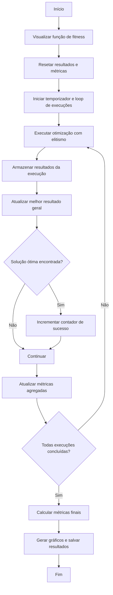
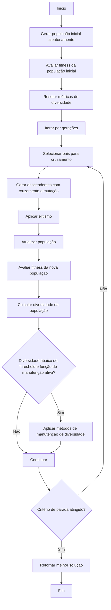

# Experimentos - Algoritmo Genético

## Estrutura do Repositório

O repositório está organizado da seguinte forma:

- **`MainOptimizationScript.py`**: Contém a implementação principal do algoritmo genético, incluindo as funções de otimização, avaliação de fitness, manutenção de diversidade, e geração de gráficos.
- **`Library`**: Diretório que contém módulos auxiliares, como métodos de seleção, cruzamento e mutação.
- **`Experiments_1A`**: Diretório onde os resultados dos experimentos são armazenados, incluindo gráficos e tabelas gerados.

## Como Iniciar o Script

Para executar o script principal e realizar as otimizações, siga o exemplo abaixo, você pode usar o script `Playground.py`:

```python
from MainOptimizationScript import MainOptimizationScript

# Inicializa objeto do algoritimo genético
OptimizationObject = MainOptimizationScript(
    FITNESS_FUNCTION_SELECTION='Levi', 
    IDENTIFIER="Levi_POP100"
)
```
Uma vez que o objeto está inicializado você pode configurar o script com base nos parâmetros de configuração a seguir.
### Parâmetros de Configuração do Script `MainOptimizationScript`

Abaixo está a lista de parâmetros de configuração disponíveis no script `MainOptimizationScript`, juntamente com suas descrições, valores padrão e possíveis valores:

| Parâmetro                      | Descrição                                                                 | Valor Padrão | Possíveis Valores                                                                 |
|--------------------------------|---------------------------------------------------------------------------|--------------|-----------------------------------------------------------------------------------|
| `POPULATION_SIZE`              | Tamanho da população inicial.                                             | `100`        | Inteiros positivos (e.g., `50`, `100`, `200`).                                   |
| `GENERATION_COUNT`             | Número máximo de gerações para a execução do algoritmo.                   | `10`         | Inteiros positivos (e.g., `10`, `50`, `100`).                                    |
| `CHROMOSOME_LENGTH`            | Comprimento do cromossomo (número de genes).                              | `2`          | Inteiros positivos (e.g., `1`, `2`, `10`).                                       |
| `LOWER_BOUND`                  | Limite inferior para os valores dos genes.                                | `-100`       | Float ou inteiro representando o limite inferior.                                |
| `UPPER_BOUND`                  | Limite superior para os valores dos genes.                                | `100`        | Float ou inteiro representando o limite superior.                                |
| `FITNESS_FUNCTION_SELECTION`   | Define a função de fitness a ser utilizada no algoritmo.                  | `'Levi'`     | `'Base'`, `'Akley'`, `'Drop-Wave'`, `'Levi'`, etc.                               |
| `SELECTION_METHOD`             | Método de seleção utilizado para escolher os pais.                        | `'Random'`   | `'Random'`, `'TournamentSelection'`, `'InvertedRouletteWheelSelection'`, `'RandomSelection'`, `'DeterministicSamplingSelection'`. |
| `SELECTION_TOURNAMENT_SIZE`    | Tamanho do torneio (aplicável ao método de seleção por torneio).          | `10`         | Inteiros positivos (e.g., `2`, `5`, `10`).                                       |
| `CROSSOVER_METHOD`             | Método de cruzamento utilizado para gerar descendentes.                   | `'Random'`   | `'Random'`, `'SinglePointCrossover'`, `'ArithmeticCrossover'`.                   |
| `CROSSOVER_RATE`               | Taxa de cruzamento entre os indivíduos.                                   | `0.8`        | Float entre `0.0` e `1.0`.                                                       |
| `MUTATION_METHOD`              | Método de mutação aplicado aos indivíduos.                                | `'RandomMutationOnIndividualGenes'` | `'RandomMutationOnIndividualGenes'`.                                             |
| `MUTATION_RATE`                | Taxa de mutação aplicada aos indivíduos.                                  | `0.5`        | Float entre `0.0` e `1.0`.                                                       |
| `APPLY_DIVERSITY_MAINTENANCE`  | Define se estratégias de manutenção de diversidade serão aplicadas.       | `True`       | `True`, `False`.                                                                 |
| `OPTIMIZATION_METHOD`          | Método de otimização utilizado no algoritmo.                              | `'Elitism'`  | `'Elitism'`.                                                                     |
| `OPTIMIZATION_METHOD_NUMBER_ELITES` | Número de indivíduos mantidos diretamente na próxima geração (elitismo).  | `10`         | Inteiros positivos menores que o tamanho da população.                           |
| `IDENTIFIER`                   | Identificador único para os experimentos, usado para salvar os resultados. | `None`       | Qualquer string representando o identificador.                                   |
| `STOPPING_METHOD`              | Critério de parada para o algoritmo.                                      | `'GenerationCount'` | `'GenerationCount'`, `'TargetFitness'`, `'NoImprovement'`.                       |
| `TARGET_FITNESS`               | Valor de fitness para interromper a execução (aplicável ao critério de parada por fitness). | `None`       | Float representando o valor de fitness desejado.                                 |
| `NO_IMPROVEMENT_LIMIT`         | Número máximo de gerações sem melhoria para interromper a execução.       | `None`       | Inteiros positivos (e.g., `10`, `20`, `50`).                                     |

Certifique-se de ajustar os valores desses parâmetros de acordo com os requisitos do seu experimento para obter os melhores resultados.

Uma vez que o objeto está configurado você tem duas opções de execução do algorítimo. Você pode executá-lo uma unica vez através de `single_optimization` ou diversas vezes e ter uma análise estática através da função `multiple_optimization`

### Execução única
```python
OptimizationObject.single_optimization
```
### Execução da otimização múltiplas vezes
Dois argumentos são utilizados na chamada dessa função, são eles:

`num_executions`: Indica a quantidade de vezes que o algorítimo genético será executado. 

`optimal_solution`: Indica a solução ótima do problema da função de fitness que deseja-se encontrar. Esse termo é opcional mas os dados de taxa de sucesso se baseiam nele.

```python
OptimizationObject.multiple_optimization(num_executions=num_executions, optimal_solution=optimal_solution)
```


## Fluxograma das Funções

### `multiple_optimization`

O fluxograma abaixo descreve o funcionamento da função `multiple_optimization`, que realiza múltiplas execuções do algoritmo genético e avalia estatisticamente os resultados:



### `elitism_optimization`

O fluxograma abaixo descreve o funcionamento da função `elitism_optimization`, que realiza a otimização utilizando o operador de elitismo:


### Métodos de Seleção

Os métodos de seleção determinam como os pais são escolhidos para gerar descendentes. Os métodos disponíveis são:

- **`TournamentSelection`**: Seleciona um grupo de indivíduos aleatórios (tamanho definido por `SELECTION_TOURNAMENT_SIZE`) e escolhe o melhor entre eles.
- **`InvertedRouletteWheelSelection`**: A probabilidade de seleção de um indivíduo é inversamente proporcional ao seu fitness. Indivíduos com menor fitness têm maior chance de serem escolhidos.
- **`RandomSelection`**: Seleciona indivíduos aleatoriamente, sem considerar o fitness.
- **`DeterministicSamplingSelection`**: Seleciona indivíduos com base em uma proporção fixa de fitness, garantindo que cada indivíduo seja representado de acordo com sua aptidão.
- **`Random`**: Alterna aleatoriamente entre os métodos `TournamentSelection`, `InvertedRouletteWheelSelection`, `RandomSelection`, e `DeterministicSamplingSelection`.

A escolha do método de seleção pode impactar diretamente a exploração e a exploração do espaço de busca.

---

### Métodos de Mutação

A mutação introduz variação nos descendentes, alterando os genes de forma aleatória. O método disponível é:

- **`RandomMutationOnIndividualGenes`**: Altera os genes de um indivíduo com uma probabilidade definida por `MUTATION_RATE`. Cada gene tem uma chance independente de ser modificado.

A mutação é essencial para evitar a convergência prematura e explorar novas regiões do espaço de busca.

---

### Métodos de Cruzamento

O cruzamento combina os genes de dois pais para gerar descendentes. Os métodos disponíveis são:

- **`SinglePointCrossover`**: Divide os cromossomos dos pais em um ponto aleatório e troca as partes para formar os descendentes.
- **`ArithmeticCrossover`**: Combina os genes dos pais usando uma média ponderada para gerar os descendentes.
- **`Random`**: Alterna aleatoriamente entre os métodos `SinglePointCrossover` e `ArithmeticCrossover`.

O cruzamento é responsável por explorar combinações promissoras de genes.

---

### Manutenção de Diversidade

A manutenção de diversidade é aplicada quando a diversidade da população cai abaixo de um limite (`threshold`). As estratégias utilizadas são:

1. **Reinicialização Parcial**: Substitui uma porcentagem da população por novos indivíduos gerados aleatoriamente.
2. **Aumento Temporário da Taxa de Mutação**: Multiplica a taxa de mutação por um fator (e.g., 1.5) para introduzir mais variação.
3. **Introdução de Indivíduos Aleatórios**: Adiciona novos indivíduos aleatórios à população.

Essas estratégias ajudam a evitar a estagnação e a melhorar a exploração do espaço de busca.

---

### Critérios de Parada

Os critérios de parada determinam quando o algoritmo deve encerrar a execução. Os critérios disponíveis são:

- **`GenerationCount`**: O algoritmo para após atingir o número máximo de gerações (`GENERATION_COUNT`).
- **`TargetFitness`**: O algoritmo para quando o melhor fitness encontrado atinge ou supera um valor alvo (`TARGET_FITNESS`).
- **`NoImprovement`**: O algoritmo para quando não há melhoria no melhor fitness por um número consecutivo de gerações (`NO_IMPROVEMENT_LIMIT`).

A escolha do critério de parada depende dos objetivos do experimento e do tempo disponível para execução.

## Experimentos
### Experimento 1
Esse experimento é executado pelo script `ExperimentSimple.py', ele é utilizado apenas pra demonstrar o código genético com uma configuração fixa. Resultados são apresentados a seguir para cada função custo.


#### Levi


### Gráficos Gerados

#### Curva de Convergência


#### Diversidade da População


#### Distribuição dos Pontos Ótimos


#### Métricas de Diversidade


### Tabelas de Resultados

Os resultados detalhados, incluindo métricas de desempenho, configurações utilizadas e dados agregados, estão disponíveis nos arquivos CSV gerados no diretório `Results`.

