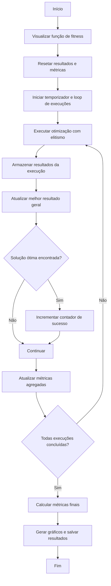
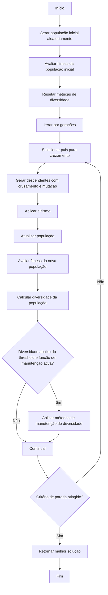

# Experimentos - Algoritmo Genético

## Estrutura do Repositório

O repositório está organizado da seguinte forma:

- **`MainOptimizationScript.py`**: Contém a implementação principal do algoritmo genético, incluindo as funções de otimização, avaliação de fitness, manutenção de diversidade, e geração de gráficos.
- **`Library`**: Diretório que contém módulos auxiliares, como métodos de seleção, cruzamento e mutação.
- **`Experiments_1A`**: Diretório onde os resultados dos experimentos são armazenados, incluindo gráficos e tabelas gerados.

## Como Iniciar o Script

Para executar o script principal e realizar as otimizações, siga o exemplo abaixo, você pode usar o script `Playground.py`:

```python
from MainOptimizationScript import MainOptimizationScript

# Inicializa objeto do algoritimo genético
OptimizationObject = MainOptimizationScript(
    FITNESS_FUNCTION_SELECTION='Levi', 
    IDENTIFIER="Levi_POP100"
)
```
Uma vez que o objeto está inicializado você pode configurar o script com base nos parâmetros de configuração a seguir.
### Parâmetros de Configuração do Script `MainOptimizationScript`

Abaixo está a lista de parâmetros de configuração disponíveis no script `MainOptimizationScript`, juntamente com suas descrições, valores padrão e possíveis valores:

| Parâmetro                      | Descrição                                                                 | Valor Padrão | Possíveis Valores                                                                 |
|--------------------------------|---------------------------------------------------------------------------|--------------|-----------------------------------------------------------------------------------|
| `POPULATION_SIZE`              | Tamanho da população inicial.                                             | `100`        | Inteiros positivos (e.g., `50`, `100`, `200`).                                   |
| `GENERATION_COUNT`             | Número máximo de gerações para a execução do algoritmo.                   | `10`         | Inteiros positivos (e.g., `10`, `50`, `100`).                                    |
| `CHROMOSOME_LENGTH`            | Comprimento do cromossomo (número de genes).                              | `2`          | Inteiros positivos (e.g., `1`, `2`, `10`).                                       |
| `LOWER_BOUND`                  | Limite inferior para os valores dos genes.                                | `-100`       | Float ou inteiro representando o limite inferior.                                |
| `UPPER_BOUND`                  | Limite superior para os valores dos genes.                                | `100`        | Float ou inteiro representando o limite superior.                                |
| `FITNESS_FUNCTION_SELECTION`   | Define a função de fitness a ser utilizada no algoritmo.                  | `'Levi'`     | `'Base'`, `'Akley'`, `'Drop-Wave'`, `'Levi'`, etc.                               |
| `SELECTION_METHOD`             | Método de seleção utilizado para escolher os pais.                        | `'Random'`   | `'Random'`, `'TournamentSelection'`, `'InvertedRouletteWheelSelection'`, `'RandomSelection'`, `'DeterministicSamplingSelection'`. |
| `SELECTION_TOURNAMENT_SIZE`    | Tamanho do torneio (aplicável ao método de seleção por torneio).          | `10`         | Inteiros positivos (e.g., `2`, `5`, `10`).                                       |
| `CROSSOVER_METHOD`             | Método de cruzamento utilizado para gerar descendentes.                   | `'Random'`   | `'Random'`, `'SinglePointCrossover'`, `'ArithmeticCrossover'`.                   |
| `CROSSOVER_RATE`               | Taxa de cruzamento entre os indivíduos.                                   | `0.8`        | Float entre `0.0` e `1.0`.                                                       |
| `MUTATION_METHOD`              | Método de mutação aplicado aos indivíduos.                                | `'RandomMutationOnIndividualGenes'` | `'RandomMutationOnIndividualGenes'`.                                             |
| `MUTATION_RATE`                | Taxa de mutação aplicada aos indivíduos.                                  | `0.5`        | Float entre `0.0` e `1.0`.                                                       |
| `APPLY_DIVERSITY_MAINTENANCE`  | Define se estratégias de manutenção de diversidade serão aplicadas.       | `True`       | `True`, `False`.                                                                 |
| `OPTIMIZATION_METHOD`          | Método de otimização utilizado no algoritmo.                              | `'Elitism'`  | `'Elitism'`.                                                                     |
| `OPTIMIZATION_METHOD_NUMBER_ELITES` | Número de indivíduos mantidos diretamente na próxima geração (elitismo).  | `10`         | Inteiros positivos menores que o tamanho da população.                           |
| `IDENTIFIER`                   | Identificador único para os experimentos, usado para salvar os resultados. | `None`       | Qualquer string representando o identificador.                                   |
| `STOPPING_METHOD`              | Critério de parada para o algoritmo.                                      | `'GenerationCount'` | `'GenerationCount'`, `'TargetFitness'`, `'NoImprovement'`.                       |
| `TARGET_FITNESS`               | Valor de fitness para interromper a execução (aplicável ao critério de parada por fitness). | `None`       | Float representando o valor de fitness desejado.                                 |
| `NO_IMPROVEMENT_LIMIT`         | Número máximo de gerações sem melhoria para interromper a execução.       | `None`       | Inteiros positivos (e.g., `10`, `20`, `50`).                                     |

Certifique-se de ajustar os valores desses parâmetros de acordo com os requisitos do seu experimento para obter os melhores resultados.

Uma vez que o objeto está configurado você tem duas opções de execução do algorítimo. Você pode executá-lo uma unica vez através de `single_optimization` ou diversas vezes e ter uma análise estática através da função `multiple_optimization`

### Execução única
```python
OptimizationObject.single_optimization
```
### Execução da otimização múltiplas vezes
Dois argumentos são utilizados na chamada dessa função, são eles:

`num_executions`: Indica a quantidade de vezes que o algorítimo genético será executado. 

`optimal_solution`: Indica a solução ótima do problema da função de fitness que deseja-se encontrar. Esse termo é opcional mas os dados de taxa de sucesso se baseiam nele.

```python
OptimizationObject.multiple_optimization(num_executions=num_executions, optimal_solution=optimal_solution)
```


## Fluxograma das Funções

### `multiple_optimization`

O fluxograma abaixo descreve o funcionamento da função `multiple_optimization`, que realiza múltiplas execuções do algoritmo genético e avalia estatisticamente os resultados:



### `elitism_optimization`

O fluxograma abaixo descreve o funcionamento da função `elitism_optimization`, que realiza a otimização utilizando o operador de elitismo:


### Métodos de Seleção

Os métodos de seleção determinam como os pais são escolhidos para gerar descendentes. Os métodos disponíveis são:

- **`TournamentSelection`**: Seleciona um grupo de indivíduos aleatórios (tamanho definido por `SELECTION_TOURNAMENT_SIZE`) e escolhe o melhor entre eles.
- **`InvertedRouletteWheelSelection`**: A probabilidade de seleção de um indivíduo é inversamente proporcional ao seu fitness. Indivíduos com menor fitness têm maior chance de serem escolhidos.
- **`RandomSelection`**: Seleciona indivíduos aleatoriamente, sem considerar o fitness.
- **`DeterministicSamplingSelection`**: Seleciona indivíduos com base em uma proporção fixa de fitness, garantindo que cada indivíduo seja representado de acordo com sua aptidão.
- **`Random`**: Alterna aleatoriamente entre os métodos `TournamentSelection`, `InvertedRouletteWheelSelection`, `RandomSelection`, e `DeterministicSamplingSelection`.

A escolha do método de seleção pode impactar diretamente a exploração e a exploração do espaço de busca.

---

### Métodos de Mutação

A mutação introduz variação nos descendentes, alterando os genes de forma aleatória. O método disponível é:

- **`RandomMutationOnIndividualGenes`**: Altera os genes de um indivíduo com uma probabilidade definida por `MUTATION_RATE`. Cada gene tem uma chance independente de ser modificado.

A mutação é essencial para evitar a convergência prematura e explorar novas regiões do espaço de busca.

---

### Métodos de Cruzamento

O cruzamento combina os genes de dois pais para gerar descendentes. Os métodos disponíveis são:

- **`SinglePointCrossover`**: Divide os cromossomos dos pais em um ponto aleatório e troca as partes para formar os descendentes.
- **`ArithmeticCrossover`**: Combina os genes dos pais usando uma média ponderada para gerar os descendentes.
- **`Random`**: Alterna aleatoriamente entre os métodos `SinglePointCrossover` e `ArithmeticCrossover`.

O cruzamento é responsável por explorar combinações promissoras de genes.

---

### Manutenção de Diversidade

A manutenção de diversidade é aplicada quando a diversidade da população cai abaixo de um limite (`threshold`). As estratégias utilizadas são:

1. **Reinicialização Parcial**: Substitui uma porcentagem da população por novos indivíduos gerados aleatoriamente.
2. **Aumento Temporário da Taxa de Mutação**: Multiplica a taxa de mutação por um fator (e.g., 1.5) para introduzir mais variação.
3. **Introdução de Indivíduos Aleatórios**: Adiciona novos indivíduos aleatórios à população.

Essas estratégias ajudam a evitar a estagnação e a melhorar a exploração do espaço de busca.

---

### Critérios de Parada

Os critérios de parada determinam quando o algoritmo deve encerrar a execução. Os critérios disponíveis são:

- **`GenerationCount`**: O algoritmo para após atingir o número máximo de gerações (`GENERATION_COUNT`).
- **`TargetFitness`**: O algoritmo para quando o melhor fitness encontrado atinge ou supera um valor alvo (`TARGET_FITNESS`).
- **`NoImprovement`**: O algoritmo para quando não há melhoria no melhor fitness por um número consecutivo de gerações (`NO_IMPROVEMENT_LIMIT`).

A escolha do critério de parada depende dos objetivos do experimento e do tempo disponível para execução.


## Experimentos

### Experimento 1
Esse experimento é executado pelo script `ExperimentSimple.py', ele é utilizado apenas pra demonstrar o código genético com uma configuração fixa. Resultados são apresentados a seguir para cada função custo.


#### <ins> Função Levi</ins>

A configuração utilizada para o experimento com a função Levi foi a seguinte:

| Parâmetro                      | Valor                              |
|--------------------------------|------------------------------------|
| `POPULATION_SIZE`              | 200                                |
| `GENERATION_COUNT`             | 100                                |
| `CHROMOSOME_LENGTH`            | 2                                  |
| `LOWER_BOUND`                  | -100                               |
| `UPPER_BOUND`                  | 100                                |
| `FITNESS_FUNCTION_SELECTION`   | Levi                               |
| `SELECTION_METHOD`             | Random                             |
| `SELECTION_TOURNAMENT_SIZE`    | 10                                 |
| `CROSSOVER_METHOD`             | Random                             |
| `CROSSOVER_RATE`               | 0.8                                |
| `MUTATION_METHOD`              | Random                             |
| `MUTATION_RATE`                | 0.1                                |
| `OPTIMIZATION_METHOD`          | Elitism                            |
| `OPTIMIZATION_METHOD_NUMBER_ELITES` | 20                          |
| `NUM_EXECUTIONS`               | 100                                |
| `OPTIMAL_SOLUTION`             | [1, 1]                             |
| `TOLERANCE`                    | 0.01                               |
| `ENABLE_FITNESS_FUNCTION_VISUALIZATION` | False                   |
| `IDENTIFIER`                   | Levi                               |

Resultados do Experimento

| Métrica                        | Valor                              |
|--------------------------------|------------------------------------|
| `Total Execution Time (s)`     | 49.38577842712402                  |
| `Success Rate (%)`             | 100.0                              |
| `Average Best Fitness`         | 6.931186853893761e-06              |
| `Best Solution Found`          | 4.344423405276921e-16              |
| `Chromosome for Best Solution` | [1.0000000019259585, 0.999999989937808] |
| `Mean of Optimal Points`       | [0.9999762205854817, 1.0000000017900224] |
| `Standard Deviation of Optimal Points` | [0.0002726099263058269, 0.0004528774520905827] |

### Gráficos Gerados

#### Curva de Convergência


#### Diversidade da População
A diversidade é calculada através da média do desvio padrão de cada gene em cada geração. O gráfico a seguir apresenta a média de diversidade de todas as execuções e o seu desvio padrão associado. 


#### Distribuição dos Pontos Ótimos
A imagem a seguir mostra os pontos ótimos obtidos para todas execuções bem sucedidas. Além disso, apresenta-se a média desses pontos ótimos e o desvio padrão associado a essa média.


#### <ins> Função Drop-Wave</ins>
A configuração utilizada para o experimento com a função Drop-wave foi a seguinte:

| Parâmetro                      | Valor                              |
|--------------------------------|------------------------------------|
| `POPULATION_SIZE`              | 200                                |
| `GENERATION_COUNT`             | 200                                |
| `CHROMOSOME_LENGTH`            | 2                                  |
| `LOWER_BOUND`                  | -100                               |
| `UPPER_BOUND`                  | 100                                |
| `FITNESS_FUNCTION_SELECTION`   | Drop-Wave                          |
| `SELECTION_METHOD`             | Random                             |
| `SELECTION_TOURNAMENT_SIZE`    | 10                                 |
| `CROSSOVER_METHOD`             | Random                             |
| `CROSSOVER_RATE`               | 0.8                                |
| `MUTATION_METHOD`              | Random                             |
| `MUTATION_RATE`                | 0.1                                |
| `OPTIMIZATION_METHOD`          | Elitism                            |
| `OPTIMIZATION_METHOD_NUMBER_ELITES` | 20                          |
| `NUM_EXECUTIONS`               | 100                                |
| `OPTIMAL_SOLUTION`             | [0, 0]                             |
| `TOLERANCE`                    | 0.01                               |
| `ENABLE_FITNESS_FUNCTION_VISUALIZATION` | False                   |
| `IDENTIFIER`                   | Drop-Wave                          |

Resultados do Experimento

| Métrica                        | Valor                              |
|--------------------------------|------------------------------------|
| `Total Execution Time (s)`     | 86.25582528114319                  |
| `Success Rate (%)`             | 92.0                               |
| `Average Best Fitness`         | -0.9948896050918223                |
| `Best Solution Found`          | -1.0                               |
| `Chromosome for Best Solution` | [1.1968360855877302e-10, -1.2295441717671068e-09] |
| `Mean of Optimal Points`       | [3.727417379878614e-05, 2.7765052998566814e-05] |
| `Standard Deviation of Optimal Points` | [0.0005256006788410745, 0.00014802600090781904] |


### Gráficos Gerados

#### Curva de Convergência


#### Diversidade da População


#### Distribuição dos Pontos Ótimos


---
### Experimento 2
O segundo experimento consistiu em variar a população inicial para cada uma das funções custo utilizadas. Para fazer isso de uma forma estrutura foi implementado o script [ExperimentPopulationSize.py](./02_PopulationSizeVariation/ExperimentPopulationSize.py).

Esse script vai executar os passos anteriormente explecitados enquanto varia a população inicial em: [50, 100, 200, 400]

Os resultados podem ser encontrados em [02_PopulationSizeVariation](./02_PopulationSizeVariation/), mas as informações principais são apresentadas a seguir.

#### <ins> Função Levi</ins>
Configuração:

| Parâmetro                      | Valor                              |
|--------------------------------|------------------------------------|
| `POPULATION_SIZE`              | 50 100 200 400                     |
| `GENERATION_COUNT`             | 100                                |
| `CHROMOSOME_LENGTH`            | 2                                  |
| `LOWER_BOUND`                  | -100                               |
| `UPPER_BOUND`                  | 100                                |
| `FITNESS_FUNCTION_SELECTION`   | Levi                               |
| `SELECTION_METHOD`             | Random                             |
| `SELECTION_TOURNAMENT_SIZE`    | 10                                 |
| `CROSSOVER_METHOD`             | Random                             |
| `CROSSOVER_RATE`               | 0.8                                |
| `MUTATION_METHOD`              | Random                             |
| `MUTATION_RATE`                | 0.225                              |
| `OPTIMIZATION_METHOD`          | Elitism                            |
| `OPTIMIZATION_METHOD_NUMBER_ELITES` | 20                          |
| `NUM_EXECUTIONS`               | 100                                |
| `OPTIMAL_SOLUTION`             | [1, 1]                             |
| `TOLERANCE`                    | 0.01                               |
| `ENABLE_FITNESS_FUNCTION_VISUALIZATION` | False                   |
| `IDENTIFIER`                   | LeviExperiment_POP50               |

Resultados:

| Métrica                        | Valor (Pop 50)                     | Valor (Pop 100)                    | Valor (Pop 200)                    | Valor (Pop 400)                    | 
|--------------------------------|------------------------------------|------------------------------------|------------------------------------|------------------------------------|
| `Total Execution Time (s)`     | 13.734084367752075                 | 24.39724111557007                  | 49.836204051971436                 | 115.94279527664185                 |
| `Success Rate (%)`             | 96.0                               | 100.0                              | 100.0                              | 100.0                              |
| `Average Best Fitness`         | 0.0002759522713756379              | 4.834148016256333e-05              | 1.4423788788487844e-05             | 5.597974456271896e-07              |
| `Best Solution Found`          | 1.6857203051960365e-09             | 5.309025825887526e-13              | 3.7200342912541225e-17             | 2.888746143425376e-14              |
| `Chromosome for Best Solution` | [1.0000007607647516, 0.9999595805494914] | [1.0000000064190506, 1.0000007260863275] | [0.9999999993852009, 0.9999999981977981] | [1.0000000057696836, 0.9999998390739089] |
| `Mean of Optimal Points`       | [1.000067980257224, 0.9999557675466907] | [1.0001405119913311, 1.0000438362952746] | [1.000035746607017, 0.9999302430277044] | [1.0000011292055253, 1.0000042500303954] |
| `Standard Deviation of Optimal Points` | [0.0017099195046880596, 0.0017906220807427506] | [0.0007007161132453017, 0.0015693413159984623] | [0.00039094460619084584, 0.0007584421942344941] | [7.544505970749895e-05, 0.00021994529289061127] |

### Gráficos Gerados

#### Sucesso vs. Tamanho da População


#### Tempo de Execução vs. Tamanho da População


#### Diversidade Média vs. Tamanho da População


#### Curvas de Convergência para Diferentes Tamanhos de População


#### <ins> Função Drop-Wave</ins>
Configuração:

| Parâmetro                      | Valor                              |
|--------------------------------|------------------------------------|
| `POPULATION_SIZE`              | 50 100 200 400                     |
| `GENERATION_COUNT`             | 200                                |
| `CHROMOSOME_LENGTH`            | 2                                  |
| `LOWER_BOUND`                  | -100                               |
| `UPPER_BOUND`                  | 100                                |
| `FITNESS_FUNCTION_SELECTION`   | Drop-Wave                          |
| `SELECTION_METHOD`             | Random                             |
| `SELECTION_TOURNAMENT_SIZE`    | 10                                 |
| `CROSSOVER_METHOD`             | Random                             |
| `CROSSOVER_RATE`               | 0.8                                |
| `MUTATION_METHOD`              | Random                             |
| `MUTATION_RATE`                | 0.1 (varia com população)          |
| `OPTIMIZATION_METHOD`          | Elitism                            |
| `OPTIMIZATION_METHOD_NUMBER_ELITES` | 20                          |
| `NUM_EXECUTIONS`               | 100                                |
| `OPTIMAL_SOLUTION`             | [0, 0]                             |
| `TOLERANCE`                    | 0.01                               |
| `ENABLE_FITNESS_FUNCTION_VISUALIZATION` | False                   |
| `IDENTIFIER`                   | Drop-WaveExperiment_POP50          |

Resultados:

| Métrica                        | Valor (Pop 50)                     | Valor (Pop 100)                    | Valor (Pop 200)                    | Valor (Pop 400)                    | 
|--------------------------------|------------------------------------|------------------------------------|------------------------------------|------------------------------------|
| `Total Execution Time (s)`     | 30.41422390937805                  | 55.762266874313354                 | 114.32732343673706                 | 260.98560070991516                 |
| `Success Rate (%)`             | 67.0                               | 66.0                               | 88.0                               | 98.0                               |
| `Average Best Fitness`         | -0.980204931140019                 | -0.9794249826693925                | -0.9946680287966604                | -0.9992923811056188                |
| `Best Solution Found`          | -0.99999999999943                  | -1.0                               | -1.0                               | -0.9999999999999998                |
| `Chromosome for Best Solution` | [-2.150870537723986e-09, 1.2537300101991205e-07] | [5.110254744307705e-10, 1.401576822006087e-09] | [-5.579270544899776e-10, 1.397761252045926e-09] | [-2.3520112836471112e-09, -1.5440200181792199e-09] |
| `Mean of Optimal Points`       | [-6.199480807987171e-05, -5.394110083363191e-05] | [-0.0001357890410971659, 0.00028054367746785337] | [5.213785344044782e-05, 8.376101174055558e-05] | [8.04094334594194e-05, -8.565309660534587e-06] |
| `Standard Deviation of Optimal Points` | [0.0015690021797839055, 0.001215205333742817] | [0.0006586359203090773, 0.0008647967860396557] | [0.000420247490047234, 0.0003959220429625053] | [0.0005975047169587559, 0.0001304449854207518] |

### Gráficos Gerados

#### Sucesso vs. Tamanho da População


#### Tempo de Execução vs. Tamanho da População


#### Diversidade Média vs. Tamanho da População


#### Curvas de Convergência para Diferentes Tamanhos de População


---


