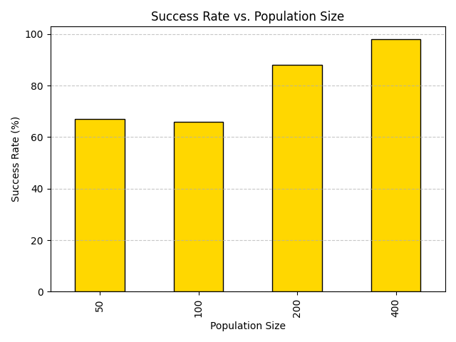
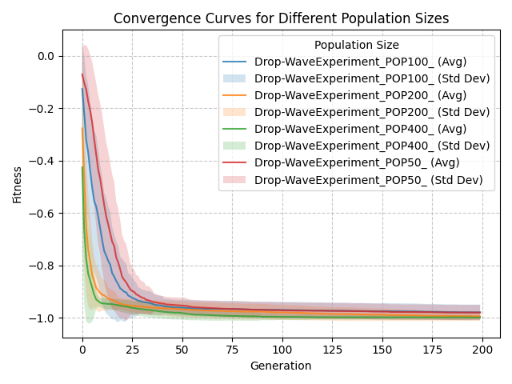
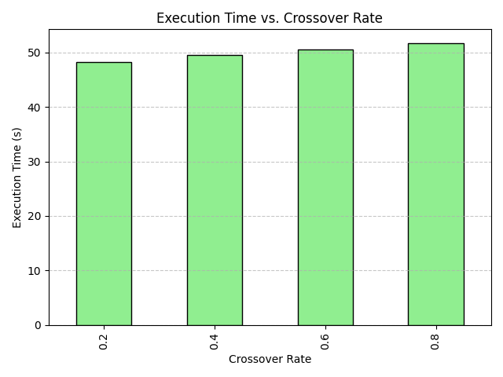
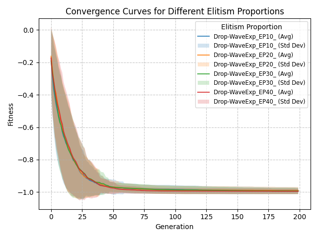

# Experimentos - Algoritmo Genético

## Estrutura do Repositório

O repositório está organizado da seguinte forma:

- **`MainOptimizationScript.py`**: Contém a implementação principal do algoritmo genético, incluindo as funções de otimização, avaliação de fitness, manutenção de diversidade, e geração de gráficos.
- **`Library`**: Diretório que contém módulos auxiliares, como métodos de seleção, cruzamento e mutação.
- **`Experiments_1A`**: Diretório onde os resultados dos experimentos são armazenados, incluindo gráficos e tabelas gerados.

## Como Iniciar o Script

Para executar o script principal e realizar as otimizações, siga o exemplo abaixo, você pode usar o script `Playground.py`:

```python
from MainOptimizationScript import MainOptimizationScript

# Inicializa objeto do algoritimo genético
OptimizationObject = MainOptimizationScript(
    FITNESS_FUNCTION_SELECTION='Levi', 
    IDENTIFIER="Levi_POP100"
)
```
Uma vez que o objeto está inicializado você pode configurar o script com base nos parâmetros de configuração a seguir.
### Parâmetros de Configuração do Script `MainOptimizationScript`

Abaixo está a lista de parâmetros de configuração disponíveis no script `MainOptimizationScript`, juntamente com suas descrições, valores padrão e possíveis valores:

| Parâmetro                      | Descrição                                                                 | Valor Padrão | Possíveis Valores                                                                 |
|--------------------------------|---------------------------------------------------------------------------|--------------|-----------------------------------------------------------------------------------|
| `POPULATION_SIZE`              | Tamanho da população inicial.                                             | `100`        | Inteiros positivos (e.g., `50`, `100`, `200`).                                   |
| `GENERATION_COUNT`             | Número máximo de gerações para a execução do algoritmo.                   | `10`         | Inteiros positivos (e.g., `10`, `50`, `100`).                                    |
| `CHROMOSOME_LENGTH`            | Comprimento do cromossomo (número de genes).                              | `2`          | Inteiros positivos (e.g., `1`, `2`, `10`).                                       |
| `LOWER_BOUND`                  | Limite inferior para os valores dos genes.                                | `-100`       | Float ou inteiro representando o limite inferior.                                |
| `UPPER_BOUND`                  | Limite superior para os valores dos genes.                                | `100`        | Float ou inteiro representando o limite superior.                                |
| `FITNESS_FUNCTION_SELECTION`   | Define a função de fitness a ser utilizada no algoritmo.                  | `'Levi'`     | `'Base'`, `'Akley'`, `'Drop-Wave'`, `'Levi'`, etc.                               |
| `SELECTION_METHOD`             | Método de seleção utilizado para escolher os pais.                        | `'Random'`   | `'Random'`, `'TournamentSelection'`, `'InvertedRouletteWheelSelection'`, `'RandomSelection'`, `'DeterministicSamplingSelection'`. |
| `SELECTION_TOURNAMENT_SIZE`    | Tamanho do torneio (aplicável ao método de seleção por torneio).          | `10`         | Inteiros positivos (e.g., `2`, `5`, `10`).                                       |
| `CROSSOVER_METHOD`             | Método de cruzamento utilizado para gerar descendentes.                   | `'Random'`   | `'Random'`, `'SinglePointCrossover'`, `'ArithmeticCrossover'`.                   |
| `CROSSOVER_RATE`               | Taxa de cruzamento entre os indivíduos.                                   | `0.8`        | Float entre `0.0` e `1.0`.                                                       |
| `MUTATION_METHOD`              | Método de mutação aplicado aos indivíduos.                                | `'RandomMutationOnIndividualGenes'` | `'RandomMutationOnIndividualGenes'`.                                             |
| `MUTATION_RATE`                | Taxa de mutação aplicada aos indivíduos.                                  | `0.5`        | Float entre `0.0` e `1.0`.                                                       |
| `APPLY_DIVERSITY_MAINTENANCE`  | Define se estratégias de manutenção de diversidade serão aplicadas.       | `True`       | `True`, `False`.                                                                 |
| `OPTIMIZATION_METHOD`          | Método de otimização utilizado no algoritmo.                              | `'Elitism'`  | `'Elitism'`.                                                                     |
| `OPTIMIZATION_METHOD_NUMBER_ELITES` | Número de indivíduos mantidos diretamente na próxima geração (elitismo).  | `10`         | Inteiros positivos menores que o tamanho da população.                           |
| `IDENTIFIER`                   | Identificador único para os experimentos, usado para salvar os resultados. | `None`       | Qualquer string representando o identificador.                                   |
| `STOPPING_METHOD`              | Critério de parada para o algoritmo.                                      | `'GenerationCount'` | `'GenerationCount'`, `'TargetFitness'`, `'NoImprovement'`.                       |
| `TARGET_FITNESS`               | Valor de fitness para interromper a execução (aplicável ao critério de parada por fitness). | `None`       | Float representando o valor de fitness desejado.                                 |
| `NO_IMPROVEMENT_LIMIT`         | Número máximo de gerações sem melhoria para interromper a execução.       | `None`       | Inteiros positivos (e.g., `10`, `20`, `50`).                                     |

Certifique-se de ajustar os valores desses parâmetros de acordo com os requisitos do seu experimento para obter os melhores resultados.

Uma vez que o objeto está configurado você tem duas opções de execução do algorítimo. Você pode executá-lo uma unica vez através de `single_optimization` ou diversas vezes e ter uma análise estática através da função `multiple_optimization`

### Execução única
```python
OptimizationObject.single_optimization
```
### Execução da otimização múltiplas vezes
Dois argumentos são utilizados na chamada dessa função, são eles:

`num_executions`: Indica a quantidade de vezes que o algorítimo genético será executado. 

`optimal_solution`: Indica a solução ótima do problema da função de fitness que deseja-se encontrar. Esse termo é opcional mas os dados de taxa de sucesso se baseiam nele.

```python
OptimizationObject.multiple_optimization(num_executions=num_executions, optimal_solution=optimal_solution)
```


## Fluxograma das Funções

### `multiple_optimization`

O fluxograma abaixo descreve o funcionamento da função `multiple_optimization`, que realiza múltiplas execuções do algoritmo genético e avalia estatisticamente os resultados:


### `elitism_optimization`

O fluxograma abaixo descreve o funcionamento da função `elitism_optimization`, que realiza a otimização utilizando o operador de elitismo:


### Métodos de Seleção

Os métodos de seleção determinam como os pais são escolhidos para gerar descendentes. Os métodos disponíveis são:

- **`TournamentSelection`**: Seleciona um grupo de indivíduos aleatórios (tamanho definido por `SELECTION_TOURNAMENT_SIZE`) e escolhe o melhor entre eles.
- **`InvertedRouletteWheelSelection`**: A probabilidade de seleção de um indivíduo é inversamente proporcional ao seu fitness. Indivíduos com menor fitness têm maior chance de serem escolhidos.
- **`RandomSelection`**: Seleciona indivíduos aleatoriamente, sem considerar o fitness.
- **`DeterministicSamplingSelection`**: Seleciona indivíduos com base em uma proporção fixa de fitness, garantindo que cada indivíduo seja representado de acordo com sua aptidão.
- **`Random`**: Alterna aleatoriamente entre os métodos `TournamentSelection`, `InvertedRouletteWheelSelection`, `RandomSelection`, e `DeterministicSamplingSelection`.

A escolha do método de seleção pode impactar diretamente a exploração e a exploração do espaço de busca.

---

### Métodos de Mutação

A mutação introduz variação nos descendentes, alterando os genes de forma aleatória. O método disponível é:

- **`RandomMutationOnIndividualGenes`**: Altera os genes de um indivíduo com uma probabilidade definida por `MUTATION_RATE`. Cada gene tem uma chance independente de ser modificado.

A mutação é essencial para evitar a convergência prematura e explorar novas regiões do espaço de busca.

---

### Métodos de Cruzamento

O cruzamento combina os genes de dois pais para gerar descendentes. Os métodos disponíveis são:

- **`SinglePointCrossover`**: Divide os cromossomos dos pais em um ponto aleatório e troca as partes para formar os descendentes.
- **`ArithmeticCrossover`**: Combina os genes dos pais usando uma média ponderada para gerar os descendentes.
- **`Random`**: Alterna aleatoriamente entre os métodos `SinglePointCrossover` e `ArithmeticCrossover`.

O cruzamento é responsável por explorar combinações promissoras de genes.

---

### Manutenção de Diversidade

A manutenção de diversidade é aplicada quando a diversidade da população cai abaixo de um limite (`threshold`). As estratégias utilizadas são:

1. **Reinicialização Parcial**: Substitui uma porcentagem da população por novos indivíduos gerados aleatoriamente.
2. **Aumento Temporário da Taxa de Mutação**: Multiplica a taxa de mutação por um fator (e.g., 1.5) para introduzir mais variação.
3. **Introdução de Indivíduos Aleatórios**: Adiciona novos indivíduos aleatórios à população.

Essas estratégias ajudam a evitar a estagnação e a melhorar a exploração do espaço de busca.

---

### Critérios de Parada

Os critérios de parada determinam quando o algoritmo deve encerrar a execução. Os critérios disponíveis são:

- **`GenerationCount`**: O algoritmo para após atingir o número máximo de gerações (`GENERATION_COUNT`).
- **`TargetFitness`**: O algoritmo para quando o melhor fitness encontrado atinge ou supera um valor alvo (`TARGET_FITNESS`).
- **`NoImprovement`**: O algoritmo para quando não há melhoria no melhor fitness por um número consecutivo de gerações (`NO_IMPROVEMENT_LIMIT`).

A escolha do critério de parada depende dos objetivos do experimento e do tempo disponível para execução.


## Experimentos

### Experimento 1
Esse experimento é executado pelo script `ExperimentSimple.py', ele é utilizado apenas pra demonstrar o código genético com uma configuração fixa. Resultados são apresentados a seguir para cada função custo.


#### <ins> Função Levi</ins>

A configuração utilizada para o experimento com a função Levi foi a seguinte:

| Parâmetro                      | Valor                              |
|--------------------------------|------------------------------------|
| `POPULATION_SIZE`              | 200                                |
| `GENERATION_COUNT`             | 100                                |
| `CHROMOSOME_LENGTH`            | 2                                  |
| `LOWER_BOUND`                  | -100                               |
| `UPPER_BOUND`                  | 100                                |
| `FITNESS_FUNCTION_SELECTION`   | Levi                               |
| `SELECTION_METHOD`             | Random                             |
| `SELECTION_TOURNAMENT_SIZE`    | 10                                 |
| `CROSSOVER_METHOD`             | Random                             |
| `CROSSOVER_RATE`               | 0.8                                |
| `MUTATION_METHOD`              | Random                             |
| `MUTATION_RATE`                | 0.1                                |
| `OPTIMIZATION_METHOD`          | Elitism                            |
| `OPTIMIZATION_METHOD_NUMBER_ELITES` | 20                          |
| `NUM_EXECUTIONS`               | 100                                |
| `OPTIMAL_SOLUTION`             | [1, 1]                             |
| `TOLERANCE`                    | 0.01                               |
| `ENABLE_FITNESS_FUNCTION_VISUALIZATION` | False                   |
| `IDENTIFIER`                   | Levi                               |

Resultados do Experimento

| Métrica                        | Valor                              |
|--------------------------------|------------------------------------|
| `Total Execution Time (s)`     | 49.38577842712402                  |
| `Success Rate (%)`             | 100.0                              |
| `Average Best Fitness`         | 6.931186853893761e-06              |
| `Best Solution Found`          | 4.344423405276921e-16              |
| `Chromosome for Best Solution` | [1.0000000019259585, 0.999999989937808] |
| `Mean of Optimal Points`       | [0.9999762205854817, 1.0000000017900224] |
| `Standard Deviation of Optimal Points` | [0.0002726099263058269, 0.0004528774520905827] |

### Gráficos Gerados

#### Curva de Convergência


#### Diversidade da População
A diversidade é calculada através da média do desvio padrão de cada gene em cada geração. O gráfico a seguir apresenta a média de diversidade de todas as execuções e o seu desvio padrão associado. 


#### Distribuição dos Pontos Ótimos
A imagem a seguir mostra os pontos ótimos obtidos para todas execuções bem sucedidas. Além disso, apresenta-se a média desses pontos ótimos e o desvio padrão associado a essa média.


#### <ins> Função Drop-Wave</ins>
A configuração utilizada para o experimento com a função Drop-wave foi a seguinte:

| Parâmetro                      | Valor                              |
|--------------------------------|------------------------------------|
| `POPULATION_SIZE`              | 200                                |
| `GENERATION_COUNT`             | 200                                |
| `CHROMOSOME_LENGTH`            | 2                                  |
| `LOWER_BOUND`                  | -100                               |
| `UPPER_BOUND`                  | 100                                |
| `FITNESS_FUNCTION_SELECTION`   | Drop-Wave                          |
| `SELECTION_METHOD`             | Random                             |
| `SELECTION_TOURNAMENT_SIZE`    | 10                                 |
| `CROSSOVER_METHOD`             | Random                             |
| `CROSSOVER_RATE`               | 0.8                                |
| `MUTATION_METHOD`              | Random                             |
| `MUTATION_RATE`                | 0.1                                |
| `OPTIMIZATION_METHOD`          | Elitism                            |
| `OPTIMIZATION_METHOD_NUMBER_ELITES` | 20                          |
| `NUM_EXECUTIONS`               | 100                                |
| `OPTIMAL_SOLUTION`             | [0, 0]                             |
| `TOLERANCE`                    | 0.01                               |
| `ENABLE_FITNESS_FUNCTION_VISUALIZATION` | False                   |
| `IDENTIFIER`                   | Drop-Wave                          |

Resultados do Experimento

| Métrica                        | Valor                              |
|--------------------------------|------------------------------------|
| `Total Execution Time (s)`     | 86.25582528114319                  |
| `Success Rate (%)`             | 92.0                               |
| `Average Best Fitness`         | -0.9948896050918223                |
| `Best Solution Found`          | -1.0                               |
| `Chromosome for Best Solution` | [1.1968360855877302e-10, -1.2295441717671068e-09] |
| `Mean of Optimal Points`       | [3.727417379878614e-05, 2.7765052998566814e-05] |
| `Standard Deviation of Optimal Points` | [0.0005256006788410745, 0.00014802600090781904] |


### Gráficos Gerados

#### Curva de Convergência


#### Diversidade da População


#### Distribuição dos Pontos Ótimos


---
### Experimento 2
O segundo experimento consistiu em variar a população inicial para cada uma das funções custo utilizadas. Para fazer isso de uma forma estrutura foi implementado o script [ExperimentPopulationSize.py](./02_PopulationSizeVariation/ExperimentPopulationSize.py).

Esse script vai executar os passos anteriormente explicitados enquanto varia a população inicial em: [50, 100, 200, 400]

Os resultados podem ser encontrados em [02_PopulationSizeVariation](./02_PopulationSizeVariation/), mas as informações principais são apresentadas a seguir.

#### <ins> Função Levi</ins>
Configuração:

| Parâmetro                      | Valor                              |
|--------------------------------|------------------------------------|
| `POPULATION_SIZE`              | 50 100 200 400                     |
| `GENERATION_COUNT`             | 100                                |
| `CHROMOSOME_LENGTH`            | 2                                  |
| `LOWER_BOUND`                  | -100                               |
| `UPPER_BOUND`                  | 100                                |
| `FITNESS_FUNCTION_SELECTION`   | Levi                               |
| `SELECTION_METHOD`             | Random                             |
| `SELECTION_TOURNAMENT_SIZE`    | 10                                 |
| `CROSSOVER_METHOD`             | Random                             |
| `CROSSOVER_RATE`               | 0.8                                |
| `MUTATION_METHOD`              | Random                             |
| `MUTATION_RATE`                | 0.225                              |
| `OPTIMIZATION_METHOD`          | Elitism                            |
| `OPTIMIZATION_METHOD_NUMBER_ELITES` | 20                          |
| `NUM_EXECUTIONS`               | 100                                |
| `OPTIMAL_SOLUTION`             | [1, 1]                             |
| `TOLERANCE`                    | 0.01                               |
| `ENABLE_FITNESS_FUNCTION_VISUALIZATION` | False                   |
| `IDENTIFIER`                   | LeviExperiment_POP50               |

Resultados:

| Métrica                        | Valor (Pop 50)                     | Valor (Pop 100)                    | Valor (Pop 200)                    | Valor (Pop 400)                    | 
|--------------------------------|------------------------------------|------------------------------------|------------------------------------|------------------------------------|
| `Total Execution Time (s)`     | 13.734084367752075                 | 24.39724111557007                  | 49.836204051971436                 | 115.94279527664185                 |
| `Success Rate (%)`             | 96.0                               | 100.0                              | 100.0                              | 100.0                              |
| `Average Best Fitness`         | 0.0002759522713756379              | 4.834148016256333e-05              | 1.4423788788487844e-05             | 5.597974456271896e-07              |
| `Best Solution Found`          | 1.6857203051960365e-09             | 5.309025825887526e-13              | 3.7200342912541225e-17             | 2.888746143425376e-14              |
| `Chromosome for Best Solution` | [1.0000007607647516, 0.9999595805494914] | [1.0000000064190506, 1.0000007260863275] | [0.9999999993852009, 0.9999999981977981] | [1.0000000057696836, 0.9999998390739089] |
| `Mean of Optimal Points`       | [1.000067980257224, 0.9999557675466907] | [1.0001405119913311, 1.0000438362952746] | [1.000035746607017, 0.9999302430277044] | [1.0000011292055253, 1.0000042500303954] |
| `Standard Deviation of Optimal Points` | [0.0017099195046880596, 0.0017906220807427506] | [0.0007007161132453017, 0.0015693413159984623] | [0.00039094460619084584, 0.0007584421942344941] | [7.544505970749895e-05, 0.00021994529289061127] |

### Gráficos Gerados

#### Sucesso vs. Tamanho da População


#### Tempo de Execução vs. Tamanho da População


#### Diversidade Média vs. Tamanho da População


#### Curvas de Convergência para Diferentes Tamanhos de População


#### <ins> Função Drop-Wave</ins>
Configuração:

| Parâmetro                      | Valor                              |
|--------------------------------|------------------------------------|
| `POPULATION_SIZE`              | 50 100 200 400                     |
| `GENERATION_COUNT`             | 200                                |
| `CHROMOSOME_LENGTH`            | 2                                  |
| `LOWER_BOUND`                  | -100                               |
| `UPPER_BOUND`                  | 100                                |
| `FITNESS_FUNCTION_SELECTION`   | Drop-Wave                          |
| `SELECTION_METHOD`             | Random                             |
| `SELECTION_TOURNAMENT_SIZE`    | 10                                 |
| `CROSSOVER_METHOD`             | Random                             |
| `CROSSOVER_RATE`               | 0.8                                |
| `MUTATION_METHOD`              | Random                             |
| `MUTATION_RATE`                | 0.1 (varia com população)          |
| `OPTIMIZATION_METHOD`          | Elitism                            |
| `OPTIMIZATION_METHOD_NUMBER_ELITES` | 20                          |
| `NUM_EXECUTIONS`               | 100                                |
| `OPTIMAL_SOLUTION`             | [0, 0]                             |
| `TOLERANCE`                    | 0.01                               |
| `ENABLE_FITNESS_FUNCTION_VISUALIZATION` | False                   |
| `IDENTIFIER`                   | Drop-WaveExperiment_POP50          |

Resultados:

| Métrica                        | Valor (Pop 50)                     | Valor (Pop 100)                    | Valor (Pop 200)                    | Valor (Pop 400)                    | 
|--------------------------------|------------------------------------|------------------------------------|------------------------------------|------------------------------------|
| `Total Execution Time (s)`     | 30.41422390937805                  | 55.762266874313354                 | 114.32732343673706                 | 260.98560070991516                 |
| `Success Rate (%)`             | 67.0                               | 66.0                               | 88.0                               | 98.0                               |
| `Average Best Fitness`         | -0.980204931140019                 | -0.9794249826693925                | -0.9946680287966604                | -0.9992923811056188                |
| `Best Solution Found`          | -0.99999999999943                  | -1.0                               | -1.0                               | -0.9999999999999998                |
| `Chromosome for Best Solution` | [-2.150870537723986e-09, 1.2537300101991205e-07] | [5.110254744307705e-10, 1.401576822006087e-09] | [-5.579270544899776e-10, 1.397761252045926e-09] | [-2.3520112836471112e-09, -1.5440200181792199e-09] |
| `Mean of Optimal Points`       | [-6.199480807987171e-05, -5.394110083363191e-05] | [-0.0001357890410971659, 0.00028054367746785337] | [5.213785344044782e-05, 8.376101174055558e-05] | [8.04094334594194e-05, -8.565309660534587e-06] |
| `Standard Deviation of Optimal Points` | [0.0015690021797839055, 0.001215205333742817] | [0.0006586359203090773, 0.0008647967860396557] | [0.000420247490047234, 0.0003959220429625053] | [0.0005975047169587559, 0.0001304449854207518] |

### Gráficos Gerados

#### Sucesso vs. Tamanho da População


#### Tempo de Execução vs. Tamanho da População


#### Diversidade Média vs. Tamanho da População


#### Curvas de Convergência para Diferentes Tamanhos de População


---
### Experimento 3
O terceiro experimento consistiu em variar a taxa de cruzamento. Para fazer isso de uma forma estrutura foi implementado o script [ExperimentCrossoverRate.py](./03_CrossoverRateVariation/ExperimentCrossoverRate.py).

Esse script vai executar os passos de execução do algorítimo genético  enquanto varia a taxa de cruzamento em: [0.2, 0.4, 0.6, 0.8]

Os resultados podem ser encontrados em [03_CrossoverRateVariation](./03_CrossoverRateVariation/), mas as informações principais são apresentadas a seguir.


#### <ins> Função Levi</ins>
Configuração:

| Parâmetro                      | Valor                              |
|--------------------------------|------------------------------------|
| `POPULATION_SIZE`              | 200                                |
| `GENERATION_COUNT`             | 100                                |
| `CHROMOSOME_LENGTH`            | 2                                  |
| `LOWER_BOUND`                  | -100                               |
| `UPPER_BOUND`                  | 100                                |
| `FITNESS_FUNCTION_SELECTION`   | Levi                               |
| `SELECTION_METHOD`             | Random                             |
| `SELECTION_TOURNAMENT_SIZE`    | 10                                 |
| `CROSSOVER_METHOD`             | Random                             |
| `CROSSOVER_RATE`               | 0.2 0.4 0.6 0.8                   |
| `MUTATION_METHOD`              | Random                             |
| `MUTATION_RATE`                | 0.1                                |
| `OPTIMIZATION_METHOD`          | Elitism                            |
| `OPTIMIZATION_METHOD_NUMBER_ELITES` | 20                          |
| `NUM_EXECUTIONS`               | 100                                |
| `OPTIMAL_SOLUTION`             | [1, 1]                             |
| `TOLERANCE`                    | 0.01                               |
| `ENABLE_FITNESS_FUNCTION_VISUALIZATION` | False                   |
| `IDENTIFIER`                   | LeviExperiment_CR20                |

Resultados:

| Métrica                        | Valor (CR 0.2)                     | Valor (CR 0.4)                     | Valor (CR 0.6)                     | Valor (CR 0.8)                     | 
|--------------------------------|------------------------------------|------------------------------------|------------------------------------|------------------------------------|
| `Total Execution Time (s)`     | 48.228148460388184                 | 49.49453020095825                  | 50.60233998298645                  | 51.648521184921265                 |
| `Success Rate (%)`             | 98.0                               | 100.0                              | 100.0                              | 100.0                              |
| `Average Best Fitness`         | 0.00030693809365380567             | 0.00016009818394668377             | 3.893211403434806e-05              | 6.717681490268055e-06              |
| `Best Solution Found`          | 1.4642394243252776e-07             | 1.850625972393934e-08              | 1.1401917115114965e-09             | 4.802642593353976e-13              |
| `Chromosome for Best Solution` | [0.9999849772778537, 0.9996448224598866] | [1.0000143430143298, 1.0000051941919639] | [0.9999982287686628, 0.9999707018303328] | [1.0000000663278827, 1.000000291689727] |
| `Mean of Optimal Points`       | [1.0000511135218595, 1.0000178000336184] | [1.000106539459325, 0.9998214685570213] | [1.0001247963164155, 1.000113624330652] | [0.9999833644398154, 0.999974880760946] |
| `Standard Deviation of Optimal Points` | [0.0013721943413688767, 0.0022036166406925756] | [0.001317891759408302, 0.0017539252978811509] | [0.0006404612788528389, 0.0008238176350856776] | [0.0002697208770926505, 0.0003968642486789746] |

### Gráficos Gerados

#### Sucesso vs. Taxa de Cruzamento


#### Tempo de Execução vs. Taxa de Cruzamento


#### Diversidade Média vs. Taxa de Cruzamento


#### Curvas de Convergência para Diferentes Taxas de Cruzamento


#### <ins> Função Drop-Wave</ins>
Configuração:

| Parâmetro                      | Valor                              |
|--------------------------------|------------------------------------|
| `POPULATION_SIZE`              | 200                                |
| `GENERATION_COUNT`             | 200                                |
| `CHROMOSOME_LENGTH`            | 2                                  |
| `LOWER_BOUND`                  | -100                               |
| `UPPER_BOUND`                  | 100                                |
| `FITNESS_FUNCTION_SELECTION`   | Drop-Wave                          |
| `SELECTION_METHOD`             | Random                             |
| `SELECTION_TOURNAMENT_SIZE`    | 10                                 |
| `CROSSOVER_METHOD`             | Random                             |
| `CROSSOVER_RATE`               | 0.2 0.4 0.6 0.8                   |
| `MUTATION_METHOD`              | Random                             |
| `MUTATION_RATE`                | 0.1                                |
| `OPTIMIZATION_METHOD`          | Elitism                            |
| `OPTIMIZATION_METHOD_NUMBER_ELITES` | 20                          |
| `NUM_EXECUTIONS`               | 100                                |
| `OPTIMAL_SOLUTION`             | [0, 0]                             |
| `TOLERANCE`                    | 0.01                               |
| `ENABLE_FITNESS_FUNCTION_VISUALIZATION` | False                   |
| `IDENTIFIER`                   | Drop-WaveExp_CR20                  |

Resultados:

| Métrica                        | Valor (CR 0.2)                     | Valor (CR 0.4)                     | Valor (CR 0.6)                     | Valor (CR 0.8)                     | 
|--------------------------------|------------------------------------|------------------------------------|------------------------------------|------------------------------------|
| `Total Execution Time (s)`     | 95.26983642578125                  | 98.79219198226929                  | 101.0256679058075                  | 100.18523359298706                 |
| `Success Rate (%)`             | 67.0                               | 69.0                               | 69.0                               | 82.0                               |
| `Average Best Fitness`         | -0.9804223691231256                | -0.9818338594675967                | -0.9834726646545026                | -0.9889905693487635                |
| `Best Solution Found`          | -0.9999997909318954                | -0.9999999959277033                | -0.9999999999999809                | -1.0                               |
| `Chromosome for Best Solution` | [-7.39395085033307e-05, -1.7330478290933536e-05] | [2.392874073023714e-07, -1.059631830150579e-05] | [-6.015759814972612e-10, 2.2936812621326693e-08] | [4.730365854521187e-12, 4.665374578432198e-11] |
| `Mean of Optimal Points`       | [-0.00027809547833298055, 0.0003140420725221098] | [-1.5583891157953607e-05, 0.00016969272682033015] | [0.000129949280166672, 0.00025699600444634564] | [-5.78694009985157e-05, 5.102668585786947e-05] |
| `Standard Deviation of Optimal Points` | [0.002001829999174437, 0.0027641386773536378] | [0.001193410728037605, 0.001331090199682656] | [0.0006149528835635319, 0.00113100987766833] | [0.00041218136304147683, 0.00038002652517376873] |

### Gráficos Gerados

#### Sucesso vs. Taxa de Cruzamento


#### Tempo de Execução vs. Taxa de Cruzamento


#### Diversidade Média vs. Taxa de Cruzamento


#### Curvas de Convergência para Diferentes Taxas de Cruzamento


---
### Experimento 4
O quarto experimento consistiu em variar a taxa de mutação. Para fazer isso de uma forma estrutura foi implementado o script [ExperimentMutationRate.py](./04_MutationRateVariation/ExperimentMutationRate.py).

Esse script vai executar os passos de execução do algorítimo genético  enquanto varia a taxa de cruzamento em: [0.05, 0.1, 0.15, 0.2]

Os resultados podem ser encontrados em [04_MutationRateVariation](./04_MutationRateVariation/), mas as informações principais são apresentadas a seguir.

#### <ins> Função Levi</ins>
Configuração:

| Parâmetro                      | Valor                              |
|--------------------------------|------------------------------------|
| `POPULATION_SIZE`              | 200                                |
| `GENERATION_COUNT`             | 100                                |
| `CHROMOSOME_LENGTH`            | 2                                  |
| `LOWER_BOUND`                  | -100                               |
| `UPPER_BOUND`                  | 100                                |
| `FITNESS_FUNCTION_SELECTION`   | Levi                               |
| `SELECTION_METHOD`             | Random                             |
| `SELECTION_TOURNAMENT_SIZE`    | 10                                 |
| `CROSSOVER_METHOD`             | Random                             |
| `CROSSOVER_RATE`               | 0.8                                |
| `MUTATION_METHOD`              | Random                             |
| `MUTATION_RATE`                | 0.05 0.1 0.15 0.2                 |
| `OPTIMIZATION_METHOD`          | Elitism                            |
| `OPTIMIZATION_METHOD_NUMBER_ELITES` | 20                          |
| `NUM_EXECUTIONS`               | 100                                |
| `OPTIMAL_SOLUTION`             | [1, 1]                             |
| `TOLERANCE`                    | 0.01                               |
| `ENABLE_FITNESS_FUNCTION_VISUALIZATION` | False                   |
| `IDENTIFIER`                   | LeviExperiment_MR5                 |

Resultados:

| Métrica                        | Valor (MR 0.05)                    | Valor (MR 0.1)                     | Valor (MR 0.15)                    | Valor (MR 0.2)                     | 
|--------------------------------|------------------------------------|------------------------------------|------------------------------------|------------------------------------|
| `Total Execution Time (s)`     | 63.64865803718567                  | 57.57697606086731                  | 65.21808528900146                  | 66.68169617652893                  |
| `Success Rate (%)`             | 100.0                              | 100.0                              | 100.0                              | 100.0                              |
| `Average Best Fitness`         | 1.8155518074823477e-05             | 6.262022127793411e-06              | 1.1006784668010278e-05             | 1.6989383898487343e-05             |
| `Best Solution Found`          | 2.2871346276861776e-15             | 9.843054514000198e-15              | 7.266389188779052e-14              | 9.607534749761284e-13              |
| `Chromosome for Best Solution` | [1.0000000049013311, 0.9999999886320652] | [0.9999999895821257, 0.9999999903045482] | [0.9999999718137011, 1.000000036051484] | [1.0000000075795743, 0.9999990224556528] |
| `Mean of Optimal Points`       | [1.000062268644595, 1.0000715495089059] | [1.0000166359933704, 1.000058596135597] | [1.0000053407649627, 0.9999727171936326] | [0.999982743277974, 0.9999620052553335] |
| `Standard Deviation of Optimal Points` | [0.00043832215474291645, 0.0007391569729526776] | [0.00025798412918568646, 0.0005053260415023057] | [0.0003478845506749992, 0.0003642856429780684] | [0.00043009413996225284, 0.0005882668552716354] |

### Gráficos Gerados

#### Sucesso vs. Taxa de Mutação


#### Tempo de Execução vs. Taxa de Mutação


#### Diversidade Média vs. Taxa de Mutação


#### Curvas de Convergência para Diferentes Taxas de Mutação


#### <ins> Função Drop-Wave</ins>
Configuração:

| Parâmetro                      | Valor                              |
|--------------------------------|------------------------------------|
| `POPULATION_SIZE`              | 200                                |
| `GENERATION_COUNT`             | 200                                |
| `CHROMOSOME_LENGTH`            | 2                                  |
| `LOWER_BOUND`                  | -100                               |
| `UPPER_BOUND`                  | 100                                |
| `FITNESS_FUNCTION_SELECTION`   | Drop-Wave                          |
| `SELECTION_METHOD`             | Random                             |
| `SELECTION_TOURNAMENT_SIZE`    | 10                                 |
| `CROSSOVER_METHOD`             | Random                             |
| `CROSSOVER_RATE`               | 0.8                                |
| `MUTATION_METHOD`              | Random                             |
| `MUTATION_RATE`                | 0.05 0.1 0.15 0.2                 |
| `OPTIMIZATION_METHOD`          | Elitism                            |
| `OPTIMIZATION_METHOD_NUMBER_ELITES` | 20                          |
| `NUM_EXECUTIONS`               | 100                                |
| `OPTIMAL_SOLUTION`             | [0, 0]                             |
| `TOLERANCE`                    | 0.01                               |
| `ENABLE_FITNESS_FUNCTION_VISUALIZATION` | False                   |
| `IDENTIFIER`                   | Drop-WaveExperiment_MR5            |

Resultados:

| Métrica                        | Valor (MR 0.05)                    | Valor (MR 0.1)                     | Valor (MR 0.15)                    | Valor (MR 0.2)                     | 
|--------------------------------|------------------------------------|------------------------------------|------------------------------------|------------------------------------|
| `Total Execution Time (s)`     | 113.43129873275757                 | 116.88155484199524                 | 105.64892077445984                 | 111.53991603851318                 |
| `Success Rate (%)`             | 87.0                               | 96.0                               | 96.0                               | 100.0                              |
| `Average Best Fitness`         | -0.9922297467129111                | -0.997388692717553                 | -0.9978793601188424                | -0.9999985210655103                |
| `Best Solution Found`          | -1.0                               | -1.0                               | -1.0                               | -1.0                               |
| `Chromosome for Best Solution` | [2.4388040545491236e-10, 8.44684146518145e-10] | [7.41533368558058e-10, 9.376036987802425e-10] | [-1.1355374296179785e-09, -7.831705304395526e-11] | [7.295278892406775e-10, 1.328472962464868e-10] |
| `Mean of Optimal Points`       | [8.478836201469852e-05, -3.993713372039226e-05] | [-0.00016810447760392825, 1.7143527631831191e-06] | [3.953382214891979e-05, -1.1649485822599492e-05] | [-2.0555567776670262e-05, -5.771386333605411e-07] |
| `Standard Deviation of Optimal Points` | [0.0004835791024148683, 0.00047994617813158026] | [0.0011904347023247042, 0.0005590537145584015] | [0.00025581721354650224, 0.0002100179023348101] | [0.00014868434998470585, 0.00013516110673886163] |

### Gráficos Gerados

#### Sucesso vs. Taxa de Mutação


#### Tempo de Execução vs. Taxa de Mutação


#### Diversidade Média vs. Taxa de Mutação


#### Curvas de Convergência para Diferentes Taxas de Mutação


### Experimento 5
O quinto experimento consistiu em variar a proporção de individuos definidos como "elites" em relação a população inicial. Para fazer isso de uma forma estrutura foi implementado o script [ExperimentElitismProportion.py](./05_ElitismProportionVariation/ExperimentElitismProportion.py).

Esse script vai executar os passos de execução do algorítimo genético  enquanto varia a proporção de elites em: [0.1, 0.2, 0.3, 0.4]

Os resultados podem ser encontrados em [05_ElitismProportionVariation](./05_ElitismProportionVariation/), mas as informações principais são apresentadas a seguir.


#### <ins> Função Levi</ins>
Configuração:

| Parâmetro                      | Valor                              |
|--------------------------------|------------------------------------|
| `POPULATION_SIZE`              | 200                                |
| `GENERATION_COUNT`             | 100                                |
| `CHROMOSOME_LENGTH`            | 2                                  |
| `LOWER_BOUND`                  | -100                               |
| `UPPER_BOUND`                  | 100                                |
| `FITNESS_FUNCTION_SELECTION`   | Levi                               |
| `SELECTION_METHOD`             | Random                             |
| `SELECTION_TOURNAMENT_SIZE`    | 10                                 |
| `CROSSOVER_METHOD`             | Random                             |
| `CROSSOVER_RATE`               | 0.8                                |
| `MUTATION_METHOD`              | Random                             |
| `MUTATION_RATE`                | 0.1                                |
| `OPTIMIZATION_METHOD`          | Elitism                            |
| `OPTIMIZATION_METHOD_NUMBER_ELITES` | 20 40 60 80                  |
| `NUM_EXECUTIONS`               | 100                                |
| `OPTIMAL_SOLUTION`             | [1, 1]                             |
| `TOLERANCE`                    | 0.01                               |
| `ENABLE_FITNESS_FUNCTION_VISUALIZATION` | False                   |
| `IDENTIFIER`                   | LeviExp_EP10                       |

Resultados:

| Métrica                        | Valor (EP 10%)                    | Valor (EP 20%)                    | Valor (EP 30%)                    | Valor (EP 40%)                    | 
|--------------------------------|------------------------------------|------------------------------------|------------------------------------|------------------------------------|
| `Total Execution Time (s)`     | 49.154149532318115                 | 53.634897232055664                 | 59.30273962020874                  | 63.667489528656006                 |
| `Success Rate (%)`             | 100.0                              | 100.0                              | 100.0                              | 100.0                              |
| `Average Best Fitness`         | 7.268079042260288e-06              | 4.581632915155468e-06              | 1.0873428498978745e-05             | 9.158646991154204e-06              |
| `Best Solution Found`          | 2.4297301516733986e-18             | 5.015575339596988e-14              | 4.851622446231831e-18              | 1.0112032540933745e-16             |
| `Chromosome for Best Solution` | [1.0000000001053546, 1.0000000011969514] | [0.9999999810556681, 0.9999998661413136] | [1.0000000002305087, 0.9999999997193532] | [0.9999999999311189, 1.0000000100346467] |
| `Mean of Optimal Points`       | [1.0000191916148697, 1.0000423331021095] | [1.0000251939121447, 0.9999892990740349] | [1.0000019269521332, 1.0000238510634842] | [1.0000343968364158, 1.0000325010985378] |
| `Standard Deviation of Optimal Points` | [0.000276977239385058, 0.0005848950437874454] | [0.0002123960386449826, 0.0006871396206837133] | [0.0003461499136057992, 0.0003315868103414719] | [0.00031248194663649313, 0.000529845885614189] |

### Gráficos Gerados

#### Sucesso vs. Proporção de Elites


#### Tempo de Execução vs. Proporção de Elites


#### Diversidade Média vs. Proporção de Elites


#### Curvas de Convergência para Diferentes Proporções de Elites


#### <ins> Função Drop-Wave</ins>
Configuração:

| Parâmetro                      | Valor                              |
|--------------------------------|------------------------------------|
| `POPULATION_SIZE`              | 200                                |
| `GENERATION_COUNT`             | 200                                |
| `CHROMOSOME_LENGTH`            | 2                                  |
| `LOWER_BOUND`                  | -100                               |
| `UPPER_BOUND`                  | 100                                |
| `FITNESS_FUNCTION_SELECTION`   | Drop-Wave                          |
| `SELECTION_METHOD`             | Random                             |
| `SELECTION_TOURNAMENT_SIZE`    | 10                                 |
| `CROSSOVER_METHOD`             | Random                             |
| `CROSSOVER_RATE`               | 0.8                                |
| `MUTATION_METHOD`              | Random                             |
| `MUTATION_RATE`                | 0.1                                |
| `OPTIMIZATION_METHOD`          | Elitism                            |
| `OPTIMIZATION_METHOD_NUMBER_ELITES` | 20 40 60 80                  |
| `NUM_EXECUTIONS`               | 100                                |
| `OPTIMAL_SOLUTION`             | [0, 0]                             |
| `TOLERANCE`                    | 0.01                               |
| `ENABLE_FITNESS_FUNCTION_VISUALIZATION` | False                   |
| `IDENTIFIER`                   | Drop-WaveExp_EP10                  |

Resultados:

| Métrica                        | Valor (EP 10%)                    | Valor (EP 20%)                    | Valor (EP 30%)                    | Valor (EP 40%)                    | 
|--------------------------------|------------------------------------|------------------------------------|------------------------------------|------------------------------------|
| `Total Execution Time (s)`     | 98.95973777770996                  | 103.28781819343567                 | 121.37364840507507                 | 133.1347851753235                 |
| `Success Rate (%)`             | 87.0                               | 86.0                               | 90.0                               | 93.0                               |
| `Average Best Fitness`         | -0.9924922223968047                | -0.9910399096521231                | -0.9940474399357737                | -0.9955427512751944                |
| `Best Solution Found`          | -1.0                               | -1.0                               | -1.0                               | -1.0                               |
| `Chromosome for Best Solution` | [-8.958218660318589e-10, -1.4088726616697334e-10] | [2.198354260466937e-10, -8.179038490174246e-10] | [-1.5394038227797313e-10, -2.678432020202786e-10] | [-1.3958852765745515e-09, -4.544971627525049e-10] |
| `Mean of Optimal Points`       | [6.207775612158132e-05, -0.0001100970356825456] | [5.126529242647239e-05, 9.365613835378687e-05] | [-5.967528707031825e-05, -3.5792985485703674e-05] | [6.427660614091573e-05, 4.823646797097185e-05] |
| `Standard Deviation of Optimal Points` | [0.00036873144562788227, 0.0009516617488339543] | [0.0008101136078005096, 0.0006614068303177757] | [0.0005006058106672425, 0.00030800788647086704] | [0.0005857361590232405, 0.0004203499385424038] |

### Gráficos Gerados

#### Sucesso vs. Proporção de Elites


#### Tempo de Execução vs. Proporção de Elites


#### Diversidade Média vs. Proporção de Elites


#### Curvas de Convergência para Diferentes Proporções de Elites
