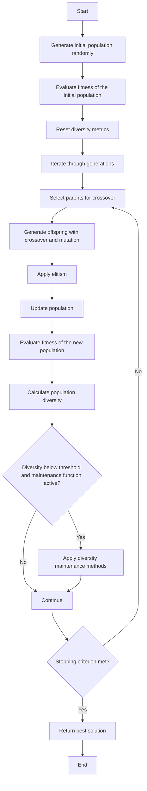

# Genetic Algorithm Experiments

## Repository Structure

The repository is organized as follows:

- **`MainOptimizationScript.py`**: Contains the main class implementation of the genetic algorithm, including optimization functions, fitness evaluation, diversity maintenance, and graph generation.
- **`Library`**: Directory containing auxiliary modules, such as selection, crossover, and mutation methods.
- **`Experiments_1A`**: Directory where experiment results are stored, including generated graphs and tables.

---

## How to Run the Script

To execute the main script and perform optimizations, follow the example below. You can use the `Playground.py` script:

```python
from MainOptimizationScript import MainOptimizationScript

# Initialize the genetic algorithm object
OptimizationObject = MainOptimizationScript(
    FITNESS_FUNCTION_SELECTION='Levi', 
    IDENTIFIER="LeviExperiment"
)
```

Once the object is initialized, you can configure the script based on the configuration parameters below.

---

### Configuration Parameters for `MainOptimizationScript`

Below is the list of configuration parameters available in the `MainOptimizationScript` script, along with their descriptions, default values, and possible values:

| Parameter                      | Description                                                              | Default Value | Possible Values                                                                 |
|--------------------------------|--------------------------------------------------------------------------|---------------|--------------------------------------------------------------------------------|
| `POPULATION_SIZE`              | Initial population size.                                                 | `100`         | Positive integers (e.g., `50`, `100`, `200`).                                  |
| `GENERATION_COUNT`             | Maximum number of generations for the algorithm execution.               | `10`          | Positive integers (e.g., `10`, `50`, `100`).                                   |
| `CHROMOSOME_LENGTH`            | Chromosome length (number of genes).                                     | `2`           | Positive integers (e.g., `1`, `2`, `10`).                                      |
| `LOWER_BOUND`                  | Lower bound for gene values.                                             | `-100`        | Float or integer representing the lower limit.                                 |
| `UPPER_BOUND`                  | Upper bound for gene values.                                             | `100`         | Float or integer representing the upper limit.                                 |
| `FITNESS_FUNCTION_SELECTION`   | Defines the fitness function to be used in the algorithm.                | `'Levi'`      | `'Base'`, `'Ackley'`, `'Drop-Wave'`, `'Levi'`, etc.                            |
| `SELECTION_METHOD`             | Selection method used to choose parents.                                 | `'Random'`    | `'Random'`, `'TournamentSelection'`, `'InvertedRouletteWheelSelection'`, `'RandomSelection'`, `'DeterministicSamplingSelection'`. |
| `SELECTION_TOURNAMENT_SIZE`    | Tournament size (applicable to the tournament selection method).         | `10`          | Positive integers (e.g., `2`, `5`, `10`).                                      |
| `CROSSOVER_METHOD`             | Crossover method used to generate offspring.                             | `'Random'`    | `'Random'`, `'SinglePointCrossover'`, `'ArithmeticCrossover'`.                 |
| `CROSSOVER_RATE`               | Crossover rate between individuals.                                      | `0.8`         | Float between `0.0` and `1.0`.                                                |
| `MUTATION_METHOD`              | Mutation method applied to individuals.                                  | `'RandomMutationOnIndividualGenes'` | `'RandomMutationOnIndividualGenes'`.                                          |
| `MUTATION_RATE`                | Mutation rate applied to individuals.                                    | `0.5`         | Float between `0.0` and `1.0`.                                                |
| `APPLY_DIVERSITY_MAINTENANCE`  | Defines whether diversity maintenance strategies will be applied.        | `True`        | `True`, `False`.                                                              |
| `OPTIMIZATION_METHOD`          | Optimization method used in the algorithm.                               | `'Elitism'`   | `'Elitism'`.                                                                  |
| `OPTIMIZATION_METHOD_NUMBER_ELITES` | Number of individuals directly maintained in the next generation (elitism). | `10`          | Positive integers less than the population size.                              |
| `IDENTIFIER`                   | Unique identifier for experiments, used to save results.                 | `None`        | Any string representing the identifier.                                       |
| `STOPPING_METHOD`              | Stopping criterion for the algorithm.                                    | `'GenerationCount'` | `'GenerationCount'`, `'TargetFitness'`, `'NoImprovement'`.                   |
| `TARGET_FITNESS`               | Fitness value to stop execution (applicable to the fitness stopping criterion). | `None`    | Float representing the desired fitness value.                                 |
| `NO_IMPROVEMENT_LIMIT`         | Maximum number of generations without improvement to stop execution.     | `None`        | Positive integers (e.g., `10`, `20`, `50`).                                   |

Ensure to adjust these parameter values according to the requirements of your experiment to achieve the best results.

---

### Running Multiple Optimizations

Two arguments are used when calling this function:

- `num_executions`: Indicates the number of times the genetic algorithm will be executed.
- `optimal_solution`: Indicates the optimal solution of the fitness function problem to be found. This term is optional, but success rate data is based on it.

```python
OptimizationObject.multiple_optimization(num_executions=num_executions, optimal_solution=optimal_solution)
```

Use the `Playground.py` script for specific tests on the genetic algorithm script. This script is pre-configured based on the information provided here.

---

## Function Flowcharts

### `multiple_optimization`

The flowchart below describes the operation of the `multiple_optimization` function, which performs multiple executions of the genetic algorithm and statistically evaluates the results:

```mermaid
flowchart TD
    A[Start] --> B[Visualize fitness function]
    B --> C[Reset results and metrics]
    C --> D[Start timer and execution loop]
    D --> E[Run optimization with elitism (elitism_optimization)]
    E --> F[Store execution results]
    F --> G[Update best overall result]
    G --> H{Optimal solution found?}
    H -->|Yes| I[Increment success counter]
    H -->|No| J[Continue]
    I --> J
    J --> K[Update aggregated metrics]
    K --> L{All executions completed?}
    L -->|No| E
    L -->|Yes| M[Calculate final metrics]
    M --> N[Generate graphs and save results]
    N --> O[End]
```

---

### `elitism_optimization`

The flowchart below describes the operation of the `elitism_optimization` function, which performs optimization using the elitism operator:



---

### Selection Methods

Selection methods determine how parents are chosen to generate offspring. The available methods are:

- **`TournamentSelection`**: Selects a group of random individuals (size defined by `SELECTION_TOURNAMENT_SIZE`) and chooses the best among them.
- **`InvertedRouletteWheelSelection`**: The probability of selecting an individual is inversely proportional to its fitness. Individuals with lower fitness have a higher chance of being chosen.
- **`RandomSelection`**: Selects individuals randomly, without considering fitness.
- **`DeterministicSamplingSelection`**: Selects individuals based on a fixed proportion of fitness, ensuring that each individual is represented according to its aptitude.
- **`Random`**: Randomly alternates between the methods `TournamentSelection`, `InvertedRouletteWheelSelection`, `RandomSelection`, and `DeterministicSamplingSelection`.

The choice of the selection method can directly impact the exploration and exploitation of the search space.

---

### Mutation Methods

Mutation introduces variation in offspring by randomly altering genes. The available method is:

- **`RandomMutationOnIndividualGenes`**: Alters the genes of an individual with a probability defined by `MUTATION_RATE`. Each gene has an independent chance of being modified.

Mutation is essential to avoid premature convergence and explore new regions of the search space.

---

### Crossover Methods

Crossover combines the genes of two parents to generate offspring. The available methods are:

- **`SinglePointCrossover`**: Splits the parents' chromosomes at a random point and swaps segments to form offspring.
- **`ArithmeticCrossover`**: Combines the parents' genes using a weighted average to generate offspring.
- **`Random`**: Randomly alternates between the methods `SinglePointCrossover` and `ArithmeticCrossover`.

Crossover is responsible for exploring promising combinations of genes.

---

### Diversity Maintenance

Diversity maintenance is applied when the population diversity falls below a threshold. The strategies used are:

1. **Partial Restart**: Replaces a percentage of the population with new randomly generated individuals.
2. **Temporary Increase in Mutation Rate**: Multiplies the mutation rate by a factor (e.g., 1.5) to introduce more variation.
3. **Introduction of Random Individuals**: Adds new random individuals to the population.

These strategies help avoid stagnation and improve the exploration of the search space.

---

### Stopping Criteria

Stopping criteria determine when the algorithm should terminate execution. The available criteria are:

- **`GenerationCount`**: The algorithm stops after reaching the maximum number of generations (`GENERATION_COUNT`).
- **`TargetFitness`**: The algorithm stops when the best fitness found reaches or exceeds a target value (`TARGET_FITNESS`).
- **`NoImprovement`**: The algorithm stops when there is no improvement in the best fitness for a consecutive number of generations (`NO_IMPROVEMENT_LIMIT`).

The choice of stopping criterion depends on the experiment's objectives and the available execution time.